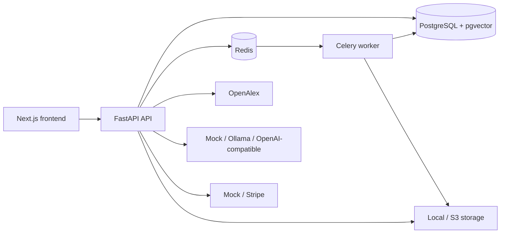

# OpenResearch Graph

OpenResearch Graph is a portfolio-grade research intelligence platform for scholarly search, citation analytics, PDF RAG, personalized recommendations and reproducible data ingestion.

The repository is designed as a **student-readable modular monolith**: the architecture is professional enough to discuss in interviews, while development mode still runs with seed data and mock providers before you create external accounts.

## Why this is not a basic CRUD project

- PostgreSQL full-text search + pgvector semantic search + reranking.
- Citation graph analysis and Personalized PageRank.
- PDF extraction, chunking, hybrid retrieval, MMR and page citations.
- Hybrid recommendation using content, collaborative, graph, popularity, recency, Open Access and feedback signals.
- Trainable PyTorch queryĂ¢â‚¬â€œpaper relevance model with baseline/evaluation notebooks.
- Cursor/snapshot ingestion with batch upsert, atomic checkpoint, resume and dead-letter records.
- Authentication with Argon2, short-lived JWT, hashed refresh tokens, token-family rotation and reuse detection.
- Mock/Stripe billing with verified webhook flow and event idempotency.
- Docker, Celery, Redis, CI, tests and Vietnamese operating manuals.

## Development modes

| Integration | Default | Real option |
|---|---|---|
| Research data | seed data | OpenAlex API/snapshot |
| Generation | mock grounded response | Ollama/OpenAI-compatible |
| Billing | mock | Stripe test mode |
| Email | console | Mailpit/SMTP |
| PDF storage | local volume | S3-compatible |

The core application must run before optional integrations are enabled.

## Quick start Ă¢â‚¬â€ Windows PowerShell

```powershell
Copy-Item .env.example .env
.\scripts\windows\setup.ps1
.\scripts\windows\doctor.ps1
.\scripts\windows\start.ps1
```

Open:

- Frontend: http://localhost:3000
- Backend: http://localhost:8000
- Swagger: http://localhost:8000/docs

Read [`docs/SETUP_GUIDE_VI.md`](docs/SETUP_GUIDE_VI.md) before adding API keys.

## Demo accounts

Development seed only:

```text
User:  user@openresearch.dev / Student123!
Admin: admin@openresearch.dev / Admin123!
```

Do not deploy these credentials to a public environment.

## Architecture



Detailed flows: [`docs/architecture.md`](docs/architecture.md).

## Repository map

```text
frontend/       Next.js App Router, TypeScript, React Query, forms, charts and graph UI
backend/        FastAPI, SQLAlchemy, Alembic, services, ML, Celery and tests
data_pipeline/  OpenAlex cursor/snapshot ingestion with checkpoint and dead-letter data
notebooks/      EDA, search baselines, recommendation baselines and model evaluation
docs/           Setup, operation, security, architecture and troubleshooting manuals
scripts/        System doctor, secret scan, integration tests and Windows automation
.github/        Backend, PostgreSQL, frontend, E2E and Docker CI
```

## Search architecture

Search combines configurable components:

```text
keyword FTS
+ pgvector cosine similarity
+ normalized citation influence
+ recency
+ Open Access boost
+ optional cross-encoder reranking
```

The database narrows candidates before Python ranking. If the optional model cannot load, the reranker falls back to a deterministic lexical implementation rather than crashing.

## PDF RAG

```text
Upload validation
Ă¢â€ â€™ private storage + checksum
Ă¢â€ â€™ Celery processing
Ă¢â€ â€™ PyMuPDF extraction and cleaning
Ă¢â€ â€™ overlapping chunks
Ă¢â€ â€™ embeddings in pgvector
Ă¢â€ â€™ FTS/vector candidates
Ă¢â€ â€™ reranking + MMR
Ă¢â€ â€™ bounded grounded prompt
Ă¢â€ â€™ answer + page/chunk citations
```

The frontend polls actual document status; it does not assume that processing finishes after a fixed delay.

## Recommendation system

The hybrid ranker includes:

- Content profile built from saved/positive paper embeddings.
- Implicit collaborative co-occurrence.
- Personalized PageRank over the citation subgraph.
- Citation popularity, recency and Open Access signals.
- Positive/negative feedback.
- MMR-style diversity and explanation strings.

Seed interactions prove the code path only. Trustworthy quality claims require a real temporal evaluation dataset.

## Deep Learning

`backend/app/ml` contains a trainable Siamese text relevance classifier receiving query, paper title and abstract. The package includes:

- Stable text hashing/tokenization.
- Dataset and padded batch collation.
- Learned embeddings and pooled query/document encoders.
- AdamW training, validation, gradient clipping and early stopping.
- Checkpoint metadata and inference loader.
- Ranking/classification metrics and baseline notebooks.

Train a small development model:

```powershell
docker compose exec backend python -m app.ml.training.train_relevance --config configs/relevance.yaml
```

## Data ingestion

API query ingestion:

```powershell
docker compose exec backend python -m data_pipeline.ingestion.openalex `
  --query "retrieval augmented generation" `
  --max-records 5000 `
  --batch-size 100
```

Snapshot streaming:

```powershell
docker compose exec backend python -m data_pipeline.ingestion.snapshot `
  --input-path /data/openalex-snapshot `
  --batch-size 5000
```

See [`data_pipeline/README.md`](data_pipeline/README.md) before running a large import.

## Database

PostgreSQL stores relational data and flexible JSONB metadata. The explicit Alembic migration creates:

- `vector` and `pgcrypto` extensions.
- Identity, paper graph, interaction, RAG, billing and recommendation tables.
- Constraints and composite indexes.
- GIN full-text indexes.
- HNSW cosine vector indexes.
- Stripe webhook event idempotency records.

MySQL is not the default because this project relies directly on PostgreSQL full-text/JSONB/pgvector behavior.

## Verification status

Performed in the delivery environment:

```text
Python compile:                 PASS
Backend unit/service tests:     94 passed
Backend measured coverage:      82%
FastAPI import/OpenAPI:          46 routes / 35 paths
TypeScript/TSX syntax parse:     35 files, 0 parse errors
JSON/YAML/notebooks:             PASS
High-confidence secret scan:     PASS
```

Not verified in the delivery environment:

- Full `npm install`, lint, Vitest, Playwright and Next.js production build because the environment could not access the npm registry.
- Docker image build and PostgreSQL migration because Docker was unavailable.
- Real OpenAlex, Stripe, SMTP, Ollama/LLM and S3 credentials.

GitHub Actions is configured to run these checks. Do not claim production readiness until your CI and real integration tests are green.

## Main quality commands

```powershell
# Backend
cd backend
$env:PYTHONPATH=".;.."
pytest tests --ignore=tests/integration --cov=app --cov-fail-under=80
python -m ruff check app tests alembic ..\data_pipeline
python -m mypy app

# Frontend
cd ..\frontend
npm install
npm run lint
npm run typecheck
npm run test:run
npm run build
npm run e2e

# Whole project
cd ..
python scripts/check_secrets.py
python scripts/system_doctor.py
```

## Documentation

Start here: [`docs/00_START_HERE_VI.md`](docs/00_START_HERE_VI.md).

Important references:

- [`docs/api.md`](docs/api.md)
- [`docs/database.md`](docs/database.md)
- [`docs/rag.md`](docs/rag.md)
- [`docs/recommendation.md`](docs/recommendation.md)
- [`docs/security.md`](docs/security.md)
- [`docs/limitations.md`](docs/limitations.md)
- [`QUALITY_UPGRADE_REPORT_V2.md`](QUALITY_UPGRADE_REPORT_V2.md)

## Honest limitations

This repository is an improved portfolio implementation, not an audited production SaaS. It does not ship millions of papers, OCR, malware scanning, a real collaborative dataset, production cookie authentication or independently verified load tests. These limitations are intentional and documented rather than hidden.

## License

MIT
