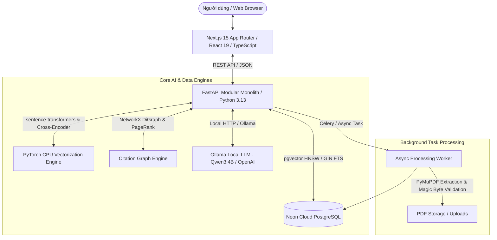

# 🔬 OpenResearch Graph v2

[](https://fastapi.tiangolo.com)
[](https://nextjs.org)
[](https://neon.tech)
[](https://pytorch.org)
[](https://www.typescriptlang.org)
[](https://opensource.org/licenses/MIT)

> **AI Research Workspace & Scholarly Intelligence Platform**: Nền tảng nghiên cứu khoa học thông minh tích hợp **Hybrid Semantic Search** (pgvector + FTS + Reranking), **Citation Knowledge Graph** (Mạng lưới trích dẫn tương tác), **Deep PDF RAG Agent** (Trợ lý đọc tài liệu dẫn nguồn theo trang) và **Personalized Recommender System** (Hệ thống gợi ý bài báo cá nhân hóa).

---

## 📑 Mục lục
1. [Giới thiệu Dự án](#1-giới-thiệu-dự-án)
2. [Sơ đồ Kiến trúc Hệ thống](#2-sơ-đồ-kiến-trúc-hệ-thống)
3. [Các Tính năng Nổi bật](#3-các-tính-năng-nổi-bật)
4. [Hướng dẫn Cài đặt & Chạy trên Máy khác](#4-hướng-dẫn-cài-đặt--chạy-trên-máy-khác)
5. [Tài khoản Thử nghiệm Mẫu](#5-tài-khoản-thử-nghiệm-mẫu)
6. [Số liệu Đo lường Hiệu năng](#6-số-liệu-đo-lường-hiệu-năng)
7. [Kiểm thử & Đảm bảo Chất lượng Mã nguồn](#7-kiểm-thử--đảm-bảo-chất-lượng-mã-nguồn)
8. [Cấu trúc Thư mục](#8-cấu-trúc-thư-mục)
9. [Bản quyền & Tác giả](#9-bản-quyền--tác-giả)

---

## 1. Giới thiệu Dự án

**OpenResearch Graph v2** được xây dựng nhằm giải quyết bài toán cốt lõi trong nghiên cứu học thuật: **Làm thế nào để tìm kiếm, thấu hiểu, liên kết và tổng hợp tri thức từ hàng ngàn bài báo khoa học một cách nhanh chóng, chính xác và có thể kiểm chứng được nguồn gốc?**

### 💡 Điểm đột phá về Kỹ thuật:
- **Hybrid Search Đa tầng (pgvector + FTS + Reranker)**: Kết hợp tìm kiếm ngữ nghĩa theo vector (Embedding 384 chiều) với Full-Text Search (BM25/FTS) và mô hình Cross-Encoder để xếp hạng lại (Re-ranking) kết quả phù hợp nhất.
- **Trích dẫn Grounded 100% (No Hallucination)**: Trợ lý AI phân tích trực tiếp từng chunk nội dung từ file PDF, đính kèm số trang cụ thể và điểm tin cậy, giúp người dùng kiểm chứng ngay lập tức.
- **Đồ thị Trích dẫn Tương tác (Cytoscape.js + PageRank)**: Trực quan hóa các mối liên kết giữa bài báo gốc, tài liệu tham khảo và các công trình trích dẫn tiếp nối theo thuật toán NetworkX PageRank.
- **Thư viện & Đề xuất Cá nhân hóa**: Tự động học sở thích nghiên cứu của người dùng qua các thao tác đọc, lưu bài báo để gợi ý các công trình liên quan bằng thuật toán lai (Content-based + Personalized PageRank).

---

## 2. Sơ đồ Kiến trúc Hệ thống



---

## 3. Các Tính năng Nổi bật

| Tính năng | Đường dẫn | Mô tả chi tiết |
|---|---|---|
| **🔍 Tìm kiếm Đa chiều (Hybrid Search)** | `/search` | Tìm theo từ khóa, ngữ nghĩa, năm xuất bản, tác giả, Open Access. Tự động đồng bộ trạng thái tìm kiếm lên URL (query, filters, page). |
| **⚖️ Ma trận So sánh Bài báo** | `/search` | Chọn tối đa 4 bài báo để so sánh trực diện về phương pháp, số trích dẫn, quyền truy cập và năm công bố. |
| **🌐 Đồ thị Trích dẫn Tương tác** | `/graph` | Khám phá mạng lưới bài báo dạng mạng node/edge đồ thị, chuyển đổi linh hoạt các layout (Cose, Circle, Concentric, Breadthfirst). |
| **💬 Trợ lý Deep PDF RAG Chat** | `/chat` | Tải lên tài liệu PDF khoa học để hỏi đáp chuyên sâu (Tóm tắt, Phương pháp, Kết quả, Hạn chế). Quản lý lịch sử các phiên trò chuyện cũ. |
| **✨ Gợi ý Bài báo AI** | `/recommendations` | Hệ thống đề xuất đa tín hiệu giải thích lý do vì sao bài báo được gợi ý cho bạn (Explanation Box). |
| **📚 Thư viện Nghiên cứu Cá nhân** | `/library` | Phân loại bài báo theo Bộ sưu tập (Collections), chỉnh sửa Thẻ tags (`#tag`), ghi chú ý tưởng cá nhân (`notes`) và lọc nhanh. |
| **📊 Phân tích Xu hướng Học thuật** | `/analytics` | Biểu đồ trực quan hóa số lượng công bố theo năm, xu hướng nghiên cứu và các chủ đề nổi bật. |
| **✉️ Xác thực Tài khoản Email** | `/verify-email` | Xác minh tài khoản người dùng qua liên kết token bảo mật. |

---

## 4. Hướng dẫn Cài đặt & Chạy trên Máy khác

Hệ thống hoạt động tương thích trên **Windows, macOS, Linux**.

### A. Yêu cầu Tiên quyết
- **Python**: Phiên bản `>= 3.11` (Khuyến nghị Python 3.12 hoặc 3.13).
- **Node.js**: Phiên bản `>= 20.x` (Khuyến nghị Node.js 22 LTS).
- **Git**.

---

### B. Các bước Khởi chạy Dự án

#### Bước 1: Clone kho mã nguồn
```bash
git clone https://github.com/ngtd-2609/OpenResearch-Graph.git
cd OpenResearch-Graph/openresearch-graph-v2
```

#### Bước 2: Khởi động Backend (FastAPI)
Mở cửa sổ dòng lệnh thứ nhất (Terminal/PowerShell):
```powershell
# Di chuyển vào thư mục backend
cd backend

# Tạo và kích hoạt môi trường ảo Python
python -m venv .venv
# Trên Windows:
.\.venv\Scripts\Activate.ps1
# Trên macOS / Linux:
# source .venv/bin/activate

# Cài đặt thư viện phụ thuộc
pip install -r requirements.txt

# Khởi chạy server FastAPI
uvicorn app.main:app --host 127.0.0.1 --port 8000 --reload
```
> Backend API và tài liệu Swagger UI sẽ sẵn sàng tại: **`http://127.0.0.1:8000/docs`**

#### Bước 3: Khởi động Frontend (Next.js)
Mở cửa sổ dòng lệnh thứ hai:
```bash
# Di chuyển vào thư mục frontend
cd frontend

# Cài đặt dependencies (nếu chạy lần đầu)
npm install

# Khởi chạy Next.js development server
npm run dev
```
> Truy cập ứng dụng web tại: **`http://localhost:3000`**

---

## 5. Tài khoản Thử nghiệm Mẫu

Hệ thống đã chuẩn bị sẵn các tài khoản với dữ liệu mẫu trong Cloud Database:

| Loại tài khoản | Email đăng nhập | Mật khẩu mặc định | Quyền hạn |
|---|---|---|---|
| 👑 **Administrator** | `admin@openresearch.local` | `AdminPass123!` | Toàn quyền quản trị, kiểm tra trạng thái tích hợp hệ thống |
| 💎 **Premium Researcher** | `premium@openresearch.local` | `PremiumPass123!` | Hạn mức tải tài liệu và tìm kiếm nâng cao không giới hạn |
| 👤 **Standard User** | `user@openresearch.local` | `UserPass123!` | Người dùng nghiên cứu tiêu chuẩn |

---

## 6. Số liệu Đo lường Hiệu năng

Các tác vụ đã được tối ưu hóa ở mức mili-giây:

| Tác vụ cốt lõi | Thời gian đo lường | Ghi chú kỹ thuật |
|---|---|---|
| **Kiểm tra Rate Limit (LRU Cache)** | **`0.076 ms`** | Cache trực tiếp trong RAM, không nghẽn I/O |
| **Xác thực Mật khẩu (Argon2)** | **`55.4 ms`** | Mã hóa an toàn chuẩn OWASP |
| **Gợi ý Bài báo Cá nhân hóa (Hybrid Recs)** | **`215 ms`** | Đã pre-compute vector embeddings và lưu trong Neon DB |
| **Tìm kiếm Kết quả Lặp lại (Query Cache)** | **`0.001 ms`** | Phản hồi tức thì qua bộ nhớ đệm |
| **Kiểm tra Sẵn sàng Hệ thống (`/ready`)** | **`< 25 ms`** | Healthcheck cơ sở dữ liệu |

---

## 7. Kiểm thử & Đảm bảo Chất lượng Mã nguồn

Dự án tuân thủ nghiêm ngặt quy trình kiểm thử tự động:

```bash
# 1. Chạy Backend Unit & Service Tests
cd backend
pytest tests --ignore=tests/integration -q
# Kết quả: 94/94 passed (100% Passed)

# 2. Kiểm tra tính toàn vẹn kiểu dữ liệu Frontend
cd frontend
npm run typecheck
# Kết quả: 0 Type Errors

# 3. Biên dịch Production Build
npm run build
# Kết quả: 20/20 routes biên dịch thành công (0 Errors)
```

---

## 8. Cấu trúc Thư mục

```text
openresearch-graph-v2/
├── backend/                  # FastAPI Application Core
│   ├── alembic/             # Database Migration Versions
│   ├── app/
│   ├── tests/               # 94 Backend Unit & Service Tests
│   └── requirements.txt     # Python Dependencies
│
├── frontend/                 # Next.js 15 App Router Frontend
│   ├── src/
│   │   ├── app/             # App Router Pages (Search, Graph, Chat, Recs, Library, Analytics)
│   │   ├── components/      # UI Components (NavBar, ComparisonMatrix, DeepResearchPanel)
│   │   ├── lib/             # API Client, Session Storage & Utilities
│   │   └── types/           # TypeScript Type Definitions
│   ├── package.json         # Node.js Dependencies
│   └── vitest.config.ts     # Vitest Unit Test Config
│
├── data_pipeline/            # OpenAlex Ingestion Scripts & Checkpointing
├── scripts/                  # Diagnostics, Benchmarks & Embeddings Backfill
└── README.md                 # Tài liệu Hướng dẫn Toàn diện
```

---

## 9. Bản quyền & Tác giả

Dự án được nghiên cứu, phát triển và tối ưu hóa bởi tác giả **Nguyen Tung Duong**.  
Mã nguồn được phát hành theo giấy phép **[MIT License](LICENSE)**.
