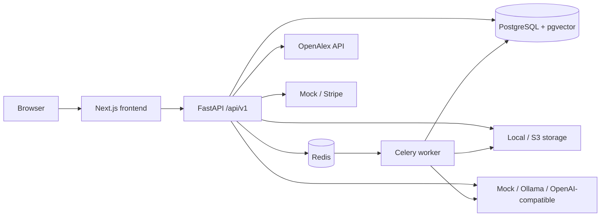
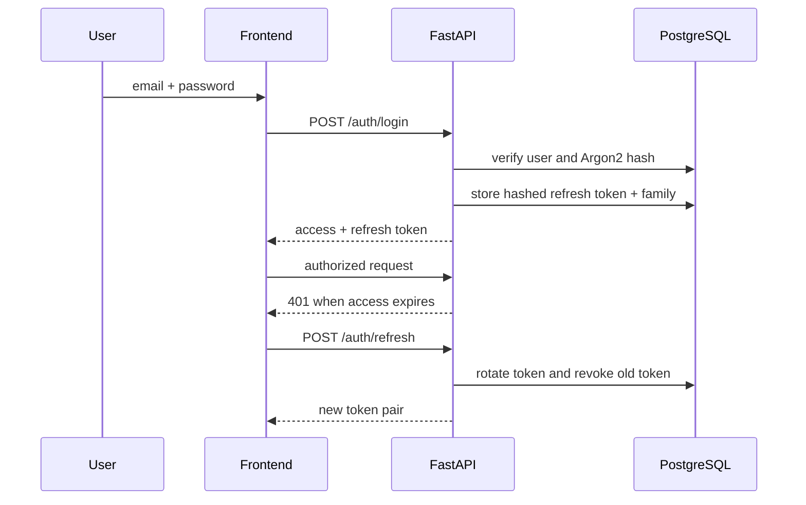
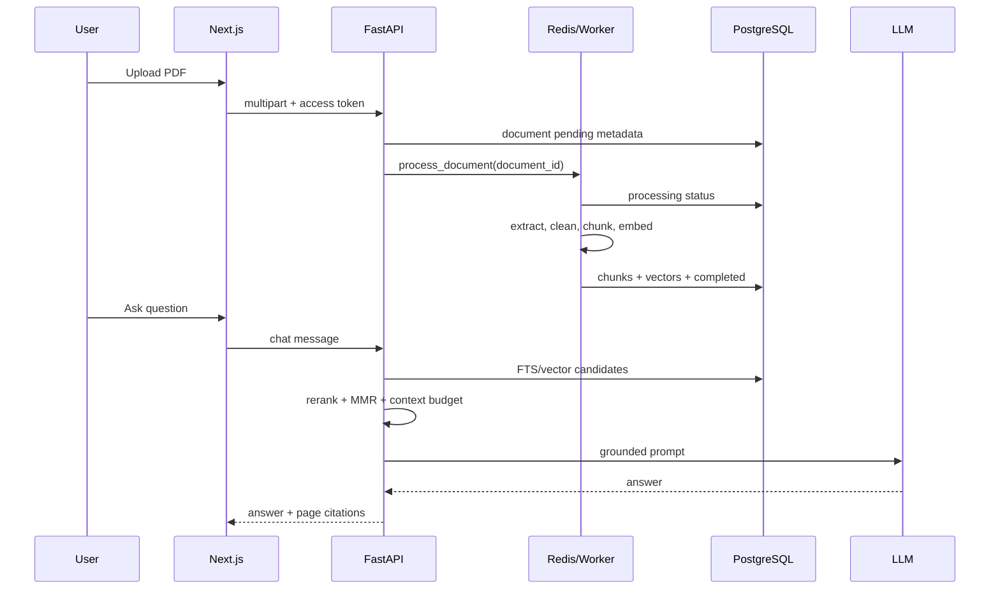
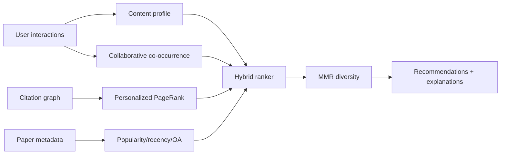

# Kiến trúc hệ thống

OpenResearch Graph dùng **modular monolith**: một repository và một domain model thống nhất, nhưng frontend, API và background worker chạy thành tiến trình riêng. Cách này dễ học/debug hơn microservices, đồng thời vẫn cho phép scale worker và API độc lập.

## Sơ đồ tổng thể



## Backend layers

```text
API routes
  ↓ request/response schemas + authorization
Services
  ↓ domain logic, retrieval, ranking, provider adapters
SQLAlchemy models / repositories
  ↓ transaction and persistence
PostgreSQL, Redis, storage, external APIs
```

Route không nên chứa thuật toán dài hoặc provider-specific code. Service không được tin `user_id` do frontend gửi nếu đã có authenticated user từ dependency.

## Luồng authentication



Development frontend lưu token để minh họa flow. Production cần secure HttpOnly refresh cookie và CSRF strategy như tài liệu security.

## Luồng PDF RAG



## Luồng recommendation



## Luồng ingestion

API ingestion dùng cursor checkpoint. Snapshot ingestion đọc từng gzip/JSONL file, normalize, batch upsert, commit, checkpoint và dead-letter record. API server không nên tự chạy job snapshot dài; dùng worker hoặc process riêng.

## Ranh giới scale

- API/worker stateless có thể scale ngang.
- PostgreSQL và storage cần backup, monitoring và capacity planning.
- Vector dimension là schema contract.
- Analytics lớn có thể chuyển sang materialized view/warehouse.
- Không tách microservice cho từng module trước khi có bottleneck và ownership rõ.
